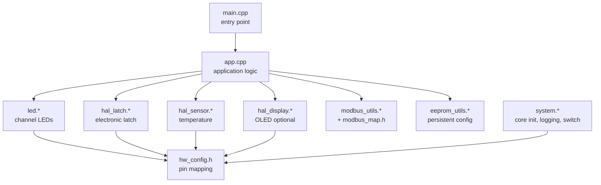

# Firmware Architecture

โครงสร้างเฟิร์มแวร์ของ LGS Standard Module หลังการ refactor เน้นการแยกส่วน
(Hardware Abstraction), ลดการเขียนโค้ดซ้ำ และรองรับการเพิ่มบอร์ด MCU ในอนาคต

---

## ภาพรวมเลเยอร์

- **main.cpp** — จุดเริ่มต้นแบบบาง เรียก init และ `appRun()` เท่านั้น
- **app.cpp / app.h** — ลอจิกการทำงานทั้งหมด (โหมด Run/Demo/SetID/FactoryReset
  และการจัดการคำสั่ง Modbus) พูดคุยกับฮาร์ดแวร์ผ่าน HAL เท่านั้น
- **HAL modules** — แยกการเข้าถึงฮาร์ดแวร์ออกจากลอจิก
  - `led.*` — ควบคุมไฟนำทางแต่ละช่อง (WS2812B)
  - `hal_latch.*` — กลไกล็อคลิ้นชัก (MOSFET + sense) พร้อม safety limit
  - `hal_sensor.*` — เซ็นเซอร์อุณหภูมิบนบอร์ด (STS4x / I2C)
  - `hal_display.*` — จอ OLED (ปิดไว้โดยค่าเริ่มต้น เปิดด้วย build flag)
- **modbus_map.h** — enum/struct ของ Register & Coil ตาม LGS Control Table
  พร้อม helper (`mbLedCfg`, `mbLedStatus`, `mbLedEnableCoil`, ...) เพื่อกำจัด
  magic number แบบ `+ i*10`
- **hw_config.h** — Pin mapping แยกตามบอร์ด เลือกด้วย build flag
- **system.* / eeprom_utils.*** — แกนระบบและการเก็บค่าถาวร

---

## การเลือกบอร์ด (Board Selection)

Pin mapping ทั้งหมดอยู่ใน [`include/hw_config.h`](../include/hw_config.h)
เลือกบอร์ดผ่าน build flag ใน `platformio.ini`

| Environment | Board | Flag |
|-------------|-------|------|
| `genericSTM32F103C8` | STM32F103C8T6 (R4.x ปัจจุบัน) | `-D LGS_BOARD_STM32F103` |
| `genericSTM32G030C8` | STM32G030C8T6 (บอร์ดรุ่นใหม่) | `-D LGS_BOARD_STM32G030` |

> Pin mapping ของ STM32G030 เป็นค่าเบื้องต้น (provisional) ต้องตรวจสอบกับ
> schematic จริงก่อนผลิต STM32G0 มีเฉพาะ USART1/USART2 (ไม่มี USART3)

การเพิ่มบอร์ดใหม่:
1. เพิ่มบล็อก `#elif defined(LGS_BOARD_xxx)` ใน `hw_config.h`
2. เพิ่ม environment ใหม่ใน `platformio.ini` พร้อม build flag
3. หากเป็น MCU ที่ไม่มี board definition ใน PlatformIO ให้เพิ่มไฟล์ JSON
   ในโฟลเดอร์ [`boards/`](../boards) (ดูตัวอย่าง `genericSTM32G030C8.json`)

---

## ฟีเจอร์เสริม (Feature Flags)

| Flag | ค่าเริ่มต้น | ผลลัพธ์ |
|------|-----------|---------|
| `LGS_ENABLE_DISPLAY=1` | ปิด | คอมไพล์โมดูลจอ OLED เข้าไป (ใช้ flash เพิ่ม) |

เมื่อปิด `LGS_ENABLE_DISPLAY` ฟังก์ชันของจอจะเป็น no-op และไลบรารี SSD1306/GFX
จะไม่ถูก link เข้าไป ช่วยประหยัด flash

---

## การขยายจำนวนช่อง (Channels)

จำนวนช่องกำหนดที่ `LED_NUM` ใน [`include/led.h`](../include/led.h) ลอจิกทั้งหมด
วนลูปด้วย `LED_NUM` จึงไม่มีโค้ดซ้ำต่อช่อง อย่างไรก็ตาม **ตาราง Modbus ปัจจุบัน
รองรับสูงสุด 8 ช่อง** (backward compatible) การขยายเกิน 8 ช่องต้องออกแบบ
register map ใหม่ (ดู [MODBUS_CONTROL_TABLE.md](MODBUS_CONTROL_TABLE.md))
